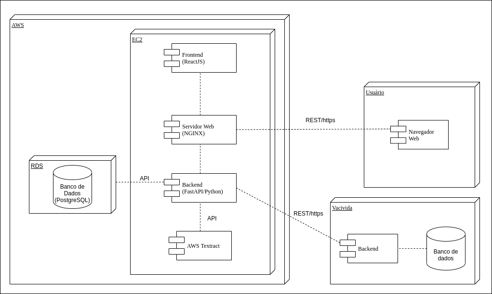
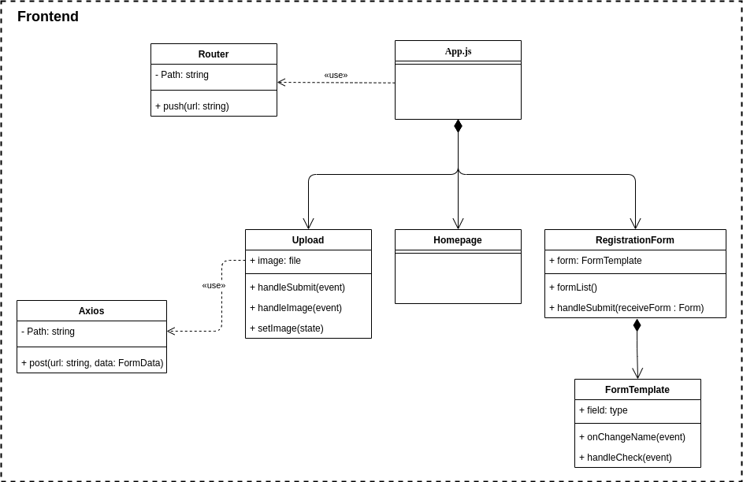

# Frontend

## 🌐 Aplicação remota

Para acessar a aplicação rodando em ambiente de produção no servidor EC2 da Amazon, acesse o link: https://vacinow.tk/.

## 🏁 Rodando o projeto

Para rodar o projeto é necessário ter docker e docker-compose instalados.

Então, para rodar a aplicação, é necessário executar na raiz do projeto o seguinte comando:


```bash
docker-compose up --build
```

## 📝 Documentação

O diagrama da arquitetura da aplicação inteira pode ser vista a seguir:



Por fim, o diagrama de classe do projeto do frontend ficou como segue:

